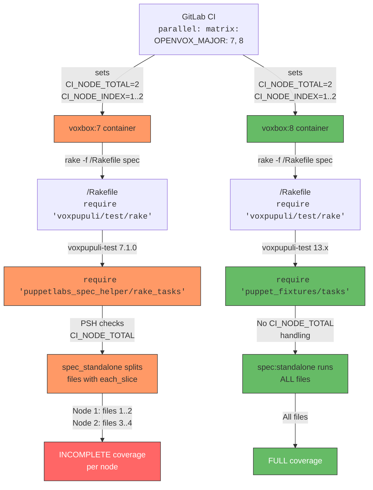
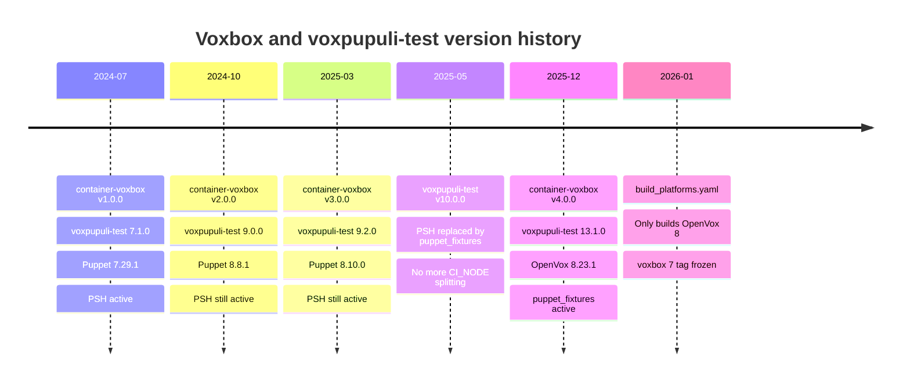

# Voxbox:7 PSH Spec-File Splitting Bug

| Field            | Value |
|------------------|-------|
| Affected image   | `ghcr.io/voxpupuli/voxbox:7` |
| Upstream project | [voxpupuli/container-voxbox](https://github.com/voxpupuli/container-voxbox) |
| Related gem      | `puppetlabs_spec_helper` (via `voxpupuli-test` 7.1.0) |
| Discovered       | 2026-02-17 |
| Status           | Workaround applied; upstream issue pending |

## Summary

When `parallel: matrix:` is used in GitLab CI to run rspec-puppet tests
against multiple OpenVox versions, the `voxbox:7` container silently splits
spec files across the matrix jobs instead of running the full suite on each
job.  This causes incomplete test coverage on every node and makes the
coverage enforcement gate fail with resources that appear "untouched."

The `voxbox:8` container is **not affected** because it ships a newer
toolchain that does not perform this splitting.

## Symptoms

- `rake spec` inside `voxbox:7` runs only a **subset** of `spec/classes/*_spec.rb`
  files (e.g. 2 of 4).
- The rspec command printed by the CI job lists explicit file paths instead of
  `--pattern spec/{classes,...}/**/*_spec.rb`.
- Coverage reports show untouched resources that ARE covered in the spec files
  that were skipped.
- The same tests pass locally with `bundle exec rake spec` (all files run).

Example CI output (2 of 4 spec files):

```
/usr/local/bin/ruby -I... rspec spec/classes/configure_spec.rb spec/classes/install_spec.rb
...
Coverage Report:
Total resources:   10
Touched resources: 8
Resource coverage: 80.00%
Untouched resources:
  Apt::Source[openproject]
  Class[Openproject::Repository]
```

## Root Cause

### Dependency Chain



### Detailed Explanation

1. **`voxbox:7` is a frozen container image.**
   The `container-voxbox` repository's `build_platforms.yaml` only builds
   OpenVox 8.  The `voxbox:7` tag on `ghcr.io` points to an image last built
   from container-voxbox **v1.0.0 / v1.1.0** (the only releases that shipped
   OpenVox 7.x).

2. **`voxbox:7` ships `voxpupuli-test` 7.1.0.**
   At that time, `voxpupuli-test`'s `lib/voxpupuli/test/rake.rb` was simply:
   ```ruby
   require 'puppetlabs_spec_helper/rake_tasks'
   ```
   The migration from `puppetlabs_spec_helper` (PSH) to `puppet_fixtures`
   happened in `voxpupuli-test` **v10.0.0** (commit `ce7b87c`, 2025-05-08).

3. **PSH's `spec_standalone` task splits spec files when `CI_NODE_TOTAL` is set.**
   The relevant code in `puppetlabs_spec_helper/rake_tasks.rb`:
   ```ruby
   RSpec::Core::RakeTask.new(:spec_standalone) do |t, args|
     if ENV['CI_NODE_TOTAL'] && ENV['CI_NODE_INDEX']
       ci_total = ENV['CI_NODE_TOTAL'].to_i
       ci_index = ENV['CI_NODE_INDEX'].to_i

       files = Rake::FileList[pattern].to_a
       per_node = (files.size / ci_total.to_f).ceil
       t.pattern = files.each_slice(per_node).to_a[ci_index - 1] || files.first
     else
       t.pattern = pattern
     end
   end
   ```
   When `CI_NODE_TOTAL=2`, it divides spec files into 2 equal slices and
   assigns each slice to a different `CI_NODE_INDEX`.

4. **GitLab CI's `parallel: matrix:` sets `CI_NODE_TOTAL` and `CI_NODE_INDEX`.**
   With 2 matrix entries (`OPENVOX_MAJOR: [7, 8]`), GitLab sets
   `CI_NODE_TOTAL=2` for both generated jobs and assigns `CI_NODE_INDEX=1` and
   `CI_NODE_INDEX=2` respectively.

5. **Result: each node runs only half the spec files.**
   With 4 spec files sorted alphabetically:
   - **Node 1** (`voxbox:7`, `CI_NODE_INDEX=1`): `configure_spec.rb`, `install_spec.rb`
   - **Node 2** (`voxbox:8`, `CI_NODE_INDEX=2`): `openproject_spec.rb`, `repository_spec.rb`

   The `voxbox:8` node is unaffected because `voxpupuli-test` 13.x uses
   `puppet_fixtures` which does **not** check `CI_NODE_TOTAL`.

### Why the File List Differs from `--pattern`

When PSH sets `t.pattern` to an **Array** (the sliced file list), the
`RSpec::Core::RakeTask#file_inclusion_specification` method
(`rspec-core/lib/rspec/core/rake_task.rb`) takes a different code path:

```ruby
def file_inclusion_specification
  if ENV['SPEC']
    FileList[ENV['SPEC']].sort
  elsif String === pattern && !File.exist?(pattern)
    "--pattern #{escape pattern}"       # <-- local run uses this
  else
    FileList[pattern].sort.map { ... }  # <-- CI uses this (pattern is Array)
  end
end
```

- When `pattern` is a **String** (glob), it passes `--pattern <glob>` to rspec.
- When `pattern` is an **Array** (PSH's sliced list), `String === pattern`
  is `false`, so it falls through to `FileList[pattern]` which resolves the
  individual files.

This explains why the CI output shows explicit file names while local runs
show `--pattern`.

## Timeline of Key Events



## Container Version Comparison

| Property                | voxbox:7                     | voxbox:8                    |
|-------------------------|------------------------------|-----------------------------|
| container-voxbox tag    | v1.0.0 / v1.1.0 (frozen)    | v4.0.0+ (actively built)   |
| `voxpupuli-test`        | 7.1.0                        | 13.1.0+                    |
| Spec helper gem         | `puppetlabs_spec_helper`     | `puppet_fixtures`           |
| `CI_NODE_TOTAL` effect  | Splits spec files            | No effect                   |
| `rspec-core`            | 3.13.3                       | 3.13.6                      |
| `rspec-puppet`          | 5.0.0                        | 5.0.0                       |
| Ruby                    | 3.2.x (Alpine)               | 3.2.x (Alpine)              |

## Workaround

Override `CI_NODE_TOTAL` to `"1"` for the `voxbox:7` matrix entry in
`.gitlab-ci.yml`.  This tells PSH that there is only one CI node, so it does
not split spec files:

```yaml
test-unit:
  extends: .test
  image:
    name: ghcr.io/voxpupuli/voxbox:${OPENVOX_MAJOR}
    entrypoint: [""]
  parallel:
    matrix:
      - OPENVOX_MAJOR: "7"
        CI_NODE_TOTAL: "1"
      - OPENVOX_MAJOR: "8"
  script:
    - $RAKE spec
```

This is applied per matrix entry so it does not affect `voxbox:8` (where the
variable is irrelevant anyway since `puppet_fixtures` ignores it).

### Why Not a Global Override?

Setting `CI_NODE_TOTAL: "1"` at the job-level `variables:` block would work
but is overly broad.  It would suppress legitimate parallel file splitting if
a future voxbox:8 image ever re-introduced it for performance reasons.  The
per-entry approach is more precise and self-documenting.

## Upstream Bug Report

### Suggested Title

> `voxbox:7` ships outdated `voxpupuli-test` (7.1.0) with PSH that
> unintentionally splits spec files when used with `parallel: matrix:`

### Suggested Description

The `voxbox:7` container image on ghcr.io ships `voxpupuli-test` 7.1.0,
which loads `puppetlabs_spec_helper/rake_tasks`.  PSH's `spec_standalone`
task checks for `CI_NODE_TOTAL` / `CI_NODE_INDEX` environment variables and,
when set, partitions spec files across CI nodes.

GitLab CI's `parallel: matrix:` keyword sets these variables even when the
matrix is used for running the **same** tests on **different** platforms
(e.g. OpenVox 7 and 8).  This causes each matrix job to run only a fraction
of the spec files, breaking test coverage.

The `voxbox:8` image (built from container-voxbox v4.0.0+) uses
`voxpupuli-test` 13.x which replaced PSH with `puppet_fixtures` and does
**not** check `CI_NODE_TOTAL`.  Only `voxbox:7` is affected.

Since `build_platforms.yaml` no longer includes OpenVox 7, the `voxbox:7`
tag on ghcr.io points to a stale image that will never be rebuilt with the
newer toolchain.

### Suggested Remediation (Upstream)

1. **Rebuild `voxbox:7`** from the current Containerfile with the latest
   gem set (voxpupuli-test 13.x, puppet_fixtures).  This would eliminate
   PSH and the splitting behavior.
2. **Alternatively, document** that `voxbox:7` is frozen and recommend
   users override `CI_NODE_TOTAL` when using `parallel: matrix:`.
3. **Long-term**: consider deprecating and removing the `voxbox:7` tag
   to prevent confusion.

### Affected Repositories

- **container-voxbox**: https://github.com/voxpupuli/container-voxbox
- **voxpupuli-test** (historical): https://github.com/voxpupuli/voxpupuli-test
- **puppetlabs_spec_helper**: https://github.com/puppetlabs/puppetlabs_spec_helper

## Research Trail

The following investigation steps were taken to identify this issue:

1. **Observed symptom**: CI `test-unit` job for OpenVox 7 showed
   `rspec spec/classes/configure_spec.rb spec/classes/install_spec.rb` (2 of
   4 files), causing 80% coverage.

2. **Verified all spec files exist**: `git ls-tree -r HEAD -- spec/classes/`
   confirmed all 4 `*_spec.rb` files are committed and tracked.

3. **Confirmed local behavior**: `bundle exec rake spec` locally ran all 4
   files with `--pattern` and achieved 100% coverage.

4. **Examined voxpupuli-test spec task**: Found that the current version
   (13.2.0) at `lib/voxpupuli/test/rake/spec.rb` uses `puppet_fixtures` and
   sets `t.pattern` to a glob string with no `CI_NODE` handling.

5. **Compared rspec-core versions**: Diffed `rake_task.rb` between 3.13.3
   (CI) and 3.13.6 (local) - files are **identical**.  Ruled out version
   difference as cause.

6. **Identified `file_inclusion_specification` logic**: Discovered that
   explicit file names (not `--pattern`) appear when `pattern` is not a
   String (i.e. an Array), pointing to PSH's `each_slice` behavior.

7. **Traced container image lineage**: Found `build_platforms.yaml` in
   `container-voxbox` only builds OpenVox 8.  The `voxbox:7` tag is frozen
   at v1.0.0/v1.1.0.

8. **Checked gem versions across releases**: Compared all container-voxbox
   tags (v1.0.0 through v4.0.1) and confirmed:
   - v1.0.0-v1.1.0 (OpenVox 7): `voxpupuli-test` 7.1.0 (uses PSH)
   - v4.0.0+ (OpenVox 8): `voxpupuli-test` 13.x (uses `puppet_fixtures`)

9. **Verified PSH migration date**: `voxpupuli-test` commit `ce7b87c`
   (2025-05-08) replaced PSH with `puppet_fixtures` in v10.0.0.

10. **Confirmed PSH splitting code**: Inspected
    `puppetlabs_spec_helper-5.0.3/lib/puppetlabs_spec_helper/rake_tasks.rb`
    lines 53-64 which implement the `CI_NODE_TOTAL` / `CI_NODE_INDEX`
    splitting with `each_slice`.

11. **Verified GitLab CI behavior**: Confirmed that `parallel: matrix:` sets
    `CI_NODE_TOTAL` and `CI_NODE_INDEX` as predefined variables for all
    generated jobs.

12. **Investigated conditional override options**: Researched GitLab CI
    approaches for per-entry variable overrides.  Found that `parallel:
    matrix:` entries can include arbitrary extra variables alongside the
    axis variable, making per-entry `CI_NODE_TOTAL` override possible.
